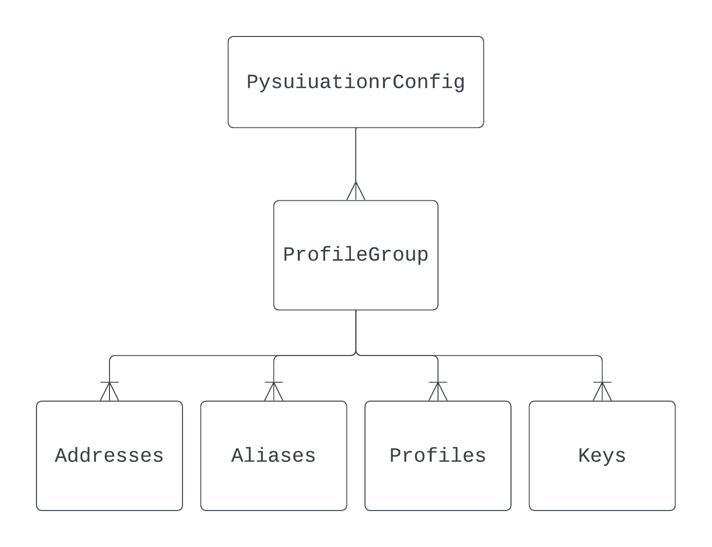

PysuiConfiguration Details
""""""""""""""""""""""""""

PysuiConfiguration is the gRPC and GraphQL replacement for the
legacy SuiConfig and this new class must be used when creating GraphQL
clients and SuiTransactions.

This page contains general class information that will aid developers
if they undertake configuration changes in their code.

tpysui
=======

To assist in editing either Mysten's ``client.yaml`` or pysui's
``PysuiConfig.json`` there is a TUI tool called `Terminal Pysui`_
that may be useful in managing configurations outside of your code.

.. _Terminal Pysui: https://github.com/Suitters/tpysui

General
=======
For JSON RPDC pysui relied on the presence of ``~/.sui`` and it's constituent
configuration elements including ``client.yaml``, ``sui.keystore``,
and ``sui.aliases`` which were all encapsulated by SuiConfig. While SuiConfig
supported some maniplations (i.e. adding new keys, alias management, etc.) it
fell short of a more robust configuration management strategy. In addition, the
code itself did not gracefully age with the advent of Sui GraphQL RPC. Until
Mysten eliminates JSON RPC, SuiConfig may continue to be used with the
JSON RPC clients.

PysuiConfiguration persists to it's own configuration location
(defaults to ``~/.pysui``) and offers more flexibility when it comes
to configuration management. Amongst other things:

#. It does not presume it's configuration is persisted to a fixed
location (configurable)
#. It supports programmatic switching between it's primary components
(see Anatomy below)
#. It has a smaller code base that, when legacy JSON RPC support is removed,
has a smaller memory footprint
#. And more...

Anatomy of PysuiConfiguration
=============================
The primary data model for PysuiConfiguration is a series of related
``dataclass`` objects:

* The root data model is ``PysuiConfiguration`` It contains or or more

    * ``ProfileGroups``, group for short, which encapsulates unique
        environment configurations. only one group can be active at a
        time in the instance. Its construct includes the following,
        all of which are configurable:

        * One or more ``Profile``, or profile, a named object containing
          individual urls for communicatinhg to Sui.
        * Associated Keys, Aliases and Addresses

PysuiConfiguration
==================

PysuiConfiguration is the primary object to interact with when managing or
using the underlying groups and profiles. However; it is import to understand
the initial setup before using it as part of the GraphQL Clients and the
arguments you can pass to the constructor rely on that understanding.

First time instantiation
------------------------

For the initial setup of PysuiConfiguration you would use the
``PysuiConfiguration.initialize_config`` class method.

Here is an example that sets up a configuration for standard GraphQL and gRPC:

.. code-block:: python
    :linenos:

    # Identify the path where PysuiConfig.json goes
    fpath = Path("~/cfgamp1")
    # Create a group definitions and load base from ~/.sui/sui_config.
    init_groups = [
        # GraphQL standard, make it active
        {
            "name": PysuiConfiguration.SUI_GQL_RPC_GROUP,
            "graphql_from_sui": True,
            "grpc_from_sui": False,
            "make_active": True,
        },
        # gRPC standard
        {
            "name": PysuiConfiguration.SUI_GRPC_GROUP,
            "graphql_from_sui": False,
            "grpc_from_sui": True,
            "make_active": False,
        },
    ]
    cfg = PysuiConfiguration.initialize_config(
        in_folder=fpath, # if parm not supplied, defaults to `~/.pysui`
        init_groups=init_groups,
    )
    print(cfg.to_json(indent=2))

If Sui binaries installed
~~~~~~~~~~~~~~~~~~~~~~~~~
During initialization a check is made for Sui binaries, while not required it
is necessary to compile Move programs when using
the SuiTransaction.publish(...) command.

The location of the ``sui`` binary will be captured,
if present, enabling Move project compiling.

If Sui binaries not installed
~~~~~~~~~~~~~~~~~~~~~~~~~~~~~
Attempting to use the ``publish`` command of a SuiTransaction will fail.

Changing PysuiConfig Active
===========================
Defaults of what is considered 'active' is whatever was last persisted
but can be changed at runtime.

At PysuiConfig Construction
----------------------------

* from_cfg_path (str) - Controls where PysuiConfiguration reads/writes
  ``PysuiConfig.json``
* group_name (str) - Sets the ``active_group`` for the session, for example:

.. code-block:: python
    :linenos:

    # Set group to builtin Sui's GraphQL RPC group
    cfg = PysuiConfiguration(group_name=PysuiConfiguration.SUI_GQL_RPC_GROUP )

    # Set group to builtin 'user' group
    cfg = PysuiConfiguration(group_name=PysuiConfiguration.SUI_USER_GROUP)

    # Set group to other user defined group
    cfg = PysuiConfiguration(group_name="Primary Group")

* profile_name (str) - Sets which profile is active of the current
  ``active_group``. It is the equivalent of ``sui client switch --env``:

.. code-block:: python
    :linenos:

    # Set group to builtin Sui's GraphQL RPC group
    cfg = PysuiConfiguration(group_name=PysuiConfiguration.SUI_GQL_RPC_GROUP, profile_name="mainnet" )

* address or alias (str) - Sets which Sui address is active using either and
  explicit address or an alias. It is the equivalent of
  ``sui client switch --address``:

.. code-block:: python
    :linenos:

    # Set group to builtin Sui's GraphQL RPC group
    cfg = PysuiConfiguration(alias="Primary")

* persist (bool) - Controls whether to persist any changes made above to
  ``PysuiConfig.json``. If not set to True the changes are in memory only.

After Construction
------------------
Changing what is active after PysuiConfiguration has been constructed is done
through the ``PysuiConfig.make_active(...)`` method. It takes the same
arguments as the constructor with the exception of the ``from_cfg_path``.

**NOTE** If changing the active group and or profile after you've constructed
a client will require creating a new client. Changing the active address will
not require recreating a client.

.. code-block:: python
    :linenos:

    # Set group to builtin Sui's GraphQL RPC group
    cfg = PysuiConfiguration(group_name=PysuiConfiguration.SUI_GQL_RPC_GROUP, profile_name="mainnet" )
    client = SyncGqlClient(pysui_config=cfg)

    # Changing active profile
    client.config.make_active(profile_name="testnet")
    client = SyncGqlClient(pysui_config=cfg)

Bottom Up Changes
=================

Profile
-------
A Profile is the equivalent of what sui CLI calls 'env' (a.k.a. environment).
It encapsulate a unique name and relevant url information such as the primary
endpoint, faucet and faucet status urls.

**WARNING** All methods support an optional ``persist`` flag argument. Keep in
mind that this will persist *any* changes that may have occured previouos where
the ``persist`` flag was set to False. If you want changes to be
ephemeral only set this to False.

The following methods are available on the PysuiConfiguration instance.

Creating a new Profile
~~~~~~~~~~~~~~~~~~~~~~
Create a new profile in an explicit group or, default, the active group.
Will raise an exception if the explicit group *does not* exist, or the
profile (with profile_name) *does* exist.

.. code-block:: python

    def new_profile(
        self,
        *,
        profile_name: str,
        url: str,
        faucet_url: Optional[str] = None,
        faucet_status_url: Optional[str] = None,
        make_active: Optional[bool] = False,
        in_group: Optional[str] = None,
        persist: Optional[bool] = True,
    ):
        """Add a new profile."""

Update Existing
~~~~~~~~~~~~~~~
Update an existing profile in an explicit group or, default, the active group.
Will raise an exception if the explicit group or the profile
(with profile_name) *does not* exist.

.. code-block:: python

    def update_profile(
        self,
        *,
        profile_name: str,
        url: str,
        faucet_url: Optional[str] = None,
        faucet_status_url: Optional[str] = None,
        in_group: Optional[str] = None,
        persist: Optional[bool] = True,
    ):
        """Update PysuiConfig.json"""

ProfileGroup
------------
In addition to Profiles the ProfileGroup manages the addresses, aliases for
addresses and private keys.

**WARNING** All methods support an optional ``persist`` flag argument. Keep in
mind that this will persist *any* changes that may have occured previouos where
the ``persist`` flag was set to False. If you want changes to be ephemeral
only, set this to False.

The following methods are available on the PysuiConfiguration instance.

Creating a new Keypair
~~~~~~~~~~~~~~~~~~~~~~
Create a new keypair of type and add to an explict group or, default, the
active group. Will raise an exception if the explicit group does *not*
exist or the optional alias *does* exist.

Returns the mnemonic string and address string upon success.

.. code-block:: python

    def new_keypair(
        self,
        *,
        of_keytype: SignatureScheme,
        in_group: Optional[str] = None,
        word_counts: Optional[int] = 12,
        derivation_path: Optional[str] = None,
        make_active: Optional[bool] = False,
        alias: Optional[str] = None,
        persist: Optional[bool] = True,
    ):
        """Generate a new keypair."""

Adding Keys to Group
~~~~~~~~~~~~~~~~~~~~~
If you do not want to generate new keys you can import
existing keys into a group.

.. code-block:: python

    def add_keys(
        self,
        *,
        key_block: list[dict[str, str]],
        in_group: Optional[str] = None,
        persist: Optional[bool] = True,
    ) -> list[str]:
        """Add a keypair."""

The ``key_block`` is a list of dictionaries containing the base64 or bech32
keystring and an optional alias, for example:

.. code-block:: python

    def populate_keys(cfg:PysuiConfiguration):
        """Add some keys to existing group."""
        block=[
            {"key_string":"ANlIGCd0ZdkpLGEsRTDzRF4q96ZQAJfuaU+G0/L93+I2","alias":"Foo"},
            {"key_string":"suiprivkey1qr3n55qy9v27a6lkwdp3jx2kcg7k3mndtsv2afsdnh086yjfntmsvgpkypq","alias":"Bar"},
            {"key_string":"AATnunevLZEyy9MFNQAWRESwhMmJucte+Gh5WjSOXC58","alias":None},
        ]
        addresses = cfg.add_keys(key_block=block, persist=False)

If no alias is provided, one will be generated. Keystrings and aliases are
checked for collisions. If successful, addresses for the added keys are returned.

Creating a new Group
~~~~~~~~~~~~~~~~~~~~
Create a new group will raise an exception if the group_name
group *already* exist.

.. code-block:: python

    def new_group(
        self,
        *,
        group_name: str,
        profile_block: list[dict[str, str]],
        key_block: list[dict[str, str]],
        active_address_index: int,
        group_protocol: GroupProtocol,
        make_group_active: Optional[bool] = False,
        persist: Optional[bool] = True,
    ) -> list[str]:
        """Add a new group."""

The following is an example of creating a fictional group:

.. code-block:: python

    def add_new_group(cfg: PysuiConfiguration):
        """Build a unique group."""
        key_blocks = [
            {"key_string": "ANlIGCd0ZdkpLGEsRTDzRF4q96ZQAJfuaU+G0/L93+I2", "alias": "Foo"},
            {"key_string": "suiprivkey1qr3n55qy9v27a6lkwdp3jx2kcg7k3mndtsv2afsdnh086yjfntmsvgpkypq", "alias": "Bar"},
            {"key_string": "AATnunevLZEyy9MFNQAWRESwhMmJucte+Gh5WjSOXC58", "alias": None},
        ]
        profile_blocks = [
            {
                "profile_name": "dev_only",
                "url": "https://dev.fictional.com",
                "faucet_url": None,
                "faucet_status_url": None,
                "make_active": False,
            },
            {
                "profile_name": "test_only",
                "url": "https://test.fictional.com",
                "faucet_url": None,
                "faucet_status_url": None,
                "make_active": True,
            },
        ]
        addies = cfg.new_group(
            group_name="emphemeral_group",
            key_block=key_blocks,
            profile_block=profile_blocks,
            active_address_index=0,
            group_protocol=GroupProtocol.OTHER,
            make_group_active=True,
            persist=False,
        )
        for addy in addies:
            print(f"Address: {addy}")

FAQ
===

Changing a configuration when in use by a pysui GraphQL client
--------------------------------------------------------------

Generally not a good idea especially changing the active_group or
active_profile. You can however change the following safely:

#. Change the active address to one that exists in the current active_group
#. Add a new group without making it active
#. Add a new profile
#. Add new keys
#. Create a new keypair

Two simultaneous clients using unique profiles
----------------------------------------------

As each GraphQL url may have different scheme versions you don't want to switch
the active profile as noted earlier. However you can create two instances of
PysuiConfiguration. For example:

.. code-block:: python

    # First client points to devnet
    devnet_cfg = PysuiConfiguration(group_name=PysuiConfiguration.SUI_GQL_RPC_GROUP,profile_name="devnet")
    devnet_client = SyncGqlClient(pysui_config=cfg,write_schema=False)

    # Next client points to testnet
    testnet_cfg = PysuiConfiguration(group_name=PysuiConfiguration.SUI_GQL_RPC_GROUP,profile_name="testnet")
    testnet_client = SyncGqlClient(pysui_config=cfg,write_schema=False)
